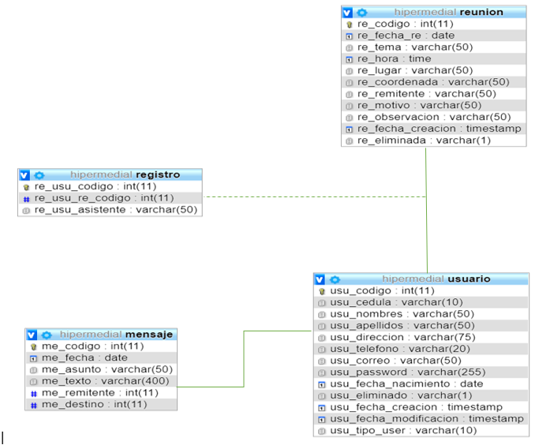
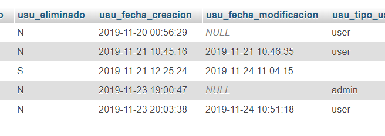
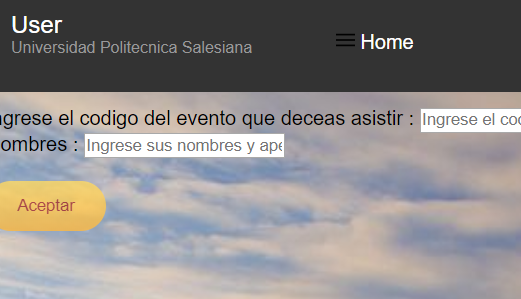
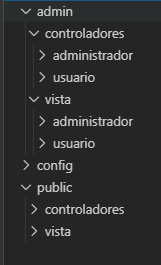

1.Diagrama  SQL 
 
 
 
2.	Con base al archivo PHP (Apuntes y ejercicios), se pide realizar los siguientes ajustes:
Agregar roles a la tabla usuario. Un usuario puede tener un rol de “admin” o “user”.
-Base de datos
  
  
-Codigo insertamos y agregamos los roles  
<!DOCTYPE html>
<html>
<head>
 <meta charset="UTF-8">
 <title>Crear Nuevo Usuario</title>
 
</head>
<body>
 <?php
 
 //incluir conexión a la base de datos
 include '../../config/conexionBD.php';
 $cedula = isset($_POST["cedula"]) ? trim($_POST["cedula"]) : null;
 $nombres = isset($_POST["nombres"]) ? mb_strtoupper(trim($_POST["nombres"]), 'UTF-8') : null;
 $apellidos = isset($_POST["apellidos"]) ? mb_strtoupper(trim($_POST["apellidos"]), 'UTF-8') :
 null;
 $direccion = isset($_POST["direccion"]) ? mb_strtoupper(trim($_POST["direccion"]), 'UTF-8') :
 null;
 $telefono = isset($_POST["telefono"]) ? trim($_POST["telefono"]): null;
 $correo = isset($_POST["correo"]) ? trim($_POST["correo"]): null;
 $fechaNacimiento = isset($_POST["fechaNacimiento"]) ? trim($_POST["fechaNacimiento"]): null;
 $contrasena = isset($_POST["contrasena"]) ? trim($_POST["contrasena"]) : null;

 $sql = "INSERT INTO usuario VALUES (0, '$cedula', '$nombres', '$apellidos', '$direccion', 
'$telefono',
'$correo', MD5('$contrasena'), '$fechaNacimiento', 'N', null, null,'user')";
 if ($conn->query($sql) === TRUE) {
    header("Location: ../../admin/vista/usuario/cuenta.php");

 } else {
 if($conn->errno == 1062){
 echo "<p class='error'>La persona con la cedula $cedula ya esta registrada en el sistema 
";
 }else{
 echo "<p class='error'>Error: " . mysqli_error($conn) . "
";
 }
 }

 //cerrar la base de datos
 $conn->close();
 

 ?>
</body>
</html>

-Interfaz

   
  
   

 

b)	Los usuarios con rol de “admin” pueden: modificar, eliminar y cambiar la contraseña de cualquier usuario de la base de datos.
-Codigo
<!DOCTYPE html>
<html>
<head>
 <meta charset="UTF-8">
 <title>Gestión de usuarios</title>
 <link rel="stylesheet" href="css/regla22.css">
</head>
<body>

<header id="main-header">
            <!--  
           Pruebas de nuevos estilos -->
            <a id="logo-header" href="#">
                    <span class="site-name">Administrador
                    <span class="site-desc">Universidad Politecnica Salesiana
                </a> <!-- / #logo-header -->

            <nav>
              <ul>
                <li><a href="adminW.php"> Home</a></li>
                <li><a href="../../controladores/usuario/cerrarSesion.php" id="">Cerrar Sesion
</a></li>
                <li><a href="eventos.php" id="">Ver Eventos</a></li>
                <li><a href=" " id="">Mis datos</a></li>
              </ul>
            </nav>
        </header>
         
         
         
         
         
         

 <table style="width:100%">
 <tr>
 <th>Cedula</th>
 <th>Nombres</th>
 <th>Apellidos</th>
 <th>Dirección</th>
 <th>Telefono</th>
 <th>Correo</th>
 <th>Fecha Nacimiento</th>
 <th>Eliminar</th>
 <th>Modificar</th>
 <th>Cambiar</th>
 </tr>
 <?php
 include '../../../config/conexionBD.php';
 $sql = "SELECT * FROM usuario where usu_eliminado= 'N'";
 $result = $conn->query($sql);

 if ($result->num_rows > 0) {

 while($row = $result->fetch_assoc()) {
 echo "<tr>";
 echo " <td>" . $row["usu_cedula"] . "</td>";
 echo " <td>" . $row['usu_nombres'] ."</td>";
 echo " <td>" . $row['usu_apellidos'] . "</td>";
 echo " <td>" . $row['usu_direccion'] . "</td>";
 echo " <td>" . $row['usu_telefono'] . "</td>";
 echo " <td>" . $row['usu_correo'] . "</td>";
 echo " <td>" . $row['usu_fecha_nacimiento'] . "</td>";
 echo " <td> <a href='eliminar.php?codigo=" . $row['usu_codigo'] . "'>Eliminar</a> </td>";
 echo " <td> <a href='modificar.php?codigo=" . $row['usu_codigo'] . "'>Modificar</a> </td>";
 echo " <td> <a href='cambiar_contrasena.php?codigo=" . $row['usu_codigo'] . "'>Cambiar
contraseña</a> </td>";

 echo "</tr>";

 }
 } else {
 echo "<tr>";
 echo " <td colspan='7'> No existen usuarios registradas en el sistema </td>";
 echo "</tr>";
 }
 $conn->close();
 ?>
 </table>
 
  
  
  
  
  
  
  
  

 <footer id="main-footer">
                Edwin Fernando Marquez Lozado &nbsp; Universidad Politecnica Salesiana &#128274;
 <a href="mailto:emarquezl@est.ups.edu.ec">emarquezl@est.ups.edu.ec</a> 
                &nbsp; <a href="tel:+0983364721">(593) 0983364721</a>    &nbsp;
                &#169; Todos los derechos reservados
            </footer>

</body>
</html>

-Interfaz
 

 
c)	Los usuarios con rol de “user” pueden modificar, eliminar y cambiar la contraseña de su usuario.
-Codigo

<!DOCTYPE html>
<html>
<head>
 <meta charset="UTF-8">
 <title>Gestión de usuarios</title>
 <link rel="stylesheet" href="css/regla2.css">
</head>
<body>

<header id="main-header">
            <!--  
           Pruebas de nuevos estilos -->
            <a id="logo-header" href="#">
                    <span class="site-name">User
                    <span class="site-desc">Universidad Politecnica Salesiana
                </a> <!-- / #logo-header -->

            <nav>
              <ul>
                <li><a href="adminW.php"> Home</a></li>
                <li><a href="../../controladores/usuario/cerrarSesion.php" id="">Cerrar Sesion
</a></li>
                <li><a href="cuenta.php" id="">Volver</a></li>
              </ul>
            </nav>
        </header>
         

 <table style="width:100%">
 <tr>
 <th>Cedula</th>
 <th>Nombres</th>
 <th>Apellidos</th>
 <th>Dirección</th>
 <th>Telefono</th>
 <th>Correo</th>
 <th>Fecha Nacimiento</th>
 <th>Modificar</th>
 <th>Cambiar</th>
 <th>Eliminar</th>

 </tr>
 <?php

 
session_start();
 
include '../../../config/conexionBD.php';
 
 $contrasena = isset($_POST["contrasena"]) ? trim($_POST["contrasena"]) : null;

 $sql = "SELECT * FROM usuario where usu_eliminado= 'N' and usu_password=MD5('$contrasena')
 and usu_tipo_user ='user'";
 $result = $conn->query($sql);

 if ($result->num_rows > 0) {

 while($row = $result->fetch_assoc()) {
 echo "<tr>";
 echo " <td>" . $row["usu_cedula"] . "</td>";
 echo " <td>" . $row['usu_nombres'] ."</td>";
 echo " <td>" . $row['usu_apellidos'] . "</td>";
 echo " <td>" . $row['usu_direccion'] . "</td>";
 echo " <td>" . $row['usu_telefono'] . "</td>";
 echo " <td>" . $row['usu_correo'] . "</td>";
 echo " <td>" . $row['usu_fecha_nacimiento'] . "</td>";
 echo " <td> <a href='modificar.php?codigo=" . $row['usu_codigo'] . "'>Modificar</a> </td>";
 echo " <td> <a href='cambiar_contrasena.php?codigo=" . $row['usu_codigo'] . "'>Cambiar
contraseña</a> </td>";
echo " <td> <a href='eliminar.php?codigo=" . $row['usu_codigo'] . "'>Eliminar</a> </td>";
 echo "</tr>";

 }
 } else {
      header("Location: seguridad.php");

 }
 $conn->close();
 ?>
 </table>
 

 <footer id="main-footer">
                Edwin Fernando Marquez Lozado &nbsp; Universidad Politecnica Salesiana 
&#128274; <a href="mailto:emarquezl@est.ups.edu.ec">emarquezl@est.ups.edu.ec</a> 
                &nbsp; <a href="tel:+0983364721">(593) 0983364721</a>    &nbsp;
                &#169; Todos los derechos reservados
            </footer>

</body>
</html>

-Interfaz
 
3.	Luego, con base a estos ajustes realizados, se pide desarrollar una aplicación web usando
PHP y Base de Datos que permita gestionar reuniones entre usuarios de la aplicación. De
las reuniones se desea conocer la fecha y hora, lugar, coordenadas (latitud y longitud)
remitente (quien invita), invitados (quienes asisten), motivo de la reunión y observaciones.
Para lo cuál, se pide como mínimo los siguientes requerimientos:
Usuario con rol de user:

d)	Visualizar en su página principal (index.php) el listado de todas las reuniones
agendadas, ordenados por las más recientes.
 

-Codigo
<?php
session_start();
if(!isset($_SESSION['isLogged']) || $_SESSION['isLogged']===FALSE){
    header("Location: /Practica04/public/vista/login.html");
}

?>

<!DOCTYPE html>
<html>

<head>
    <meta charset="UTF-8">
    <link rel="stylesheet" href="css/regla2.css">
    
    <title>Cuenta</title>
</head>

<body>

    <div class="contenedor">

    <header id="main-header">
            <!--  
           Pruebas de nuevos estilos -->
            <a id="logo-header" href="#">
                    <span class="site-name">User 
                    <span class="site-desc">Universidad Politecnica Salesiana
                </a> <!-- / #logo-header -->

            <nav>
              <ul>
                <li><a href="cuenta.php"> Home</a></li>
                <li><a href="../../controladores/usuario/cerrarSesion.php" id="">Cerrar Sesion
</a></li>
                <li><a href="crear_reuniones.php" id="">Crear Evento</a></li>
                <li><a href="seguridad.php" id="">Mis datos</a></li>
              </ul>
            </nav>
        </header>
         
      
        <form id="formulario01" action="../../controladores/usuario/reAsistir.php" method="POST" >
         
        <label for="regis">Ingrese el codigo del evento que deceas asistir :</label>
                <input type="text" id="regis" name="regis" value="" placeholder="Ingrese el 
codigo" />
        
                 
                <label for="nombres">Nombres :</label>
                <input type="text" id="nombres" name="nombres" value="" placeholder="Ingrese 
sus nombres y apellidos" />
                 
 

                <input type="submit" class="ingresar" id="crear" name="crear" value="Aceptar" 
                style="  background: linear-gradient(#FFDA63, #FFB940);
                         border: 0;
                            color: brown;
                             opacity: 0.8;
                                 cursor: pointer;
                                    border-radius: 25px;
                                     height: 40px;
                                     width:10%;
                                         text-align: center;" />
             </form> 
              
                 
         
        
        <label for="nombres">Buscar Evento:</label>
        <form  onsubmit="return buscarPormotivo()">
                <input type="text" id="cedula" name="cedula" value="">
                <input type="button" id="buscar" name="buscar" value="Buscar" 
onclick="buscarPormotivo()">
        </form>
         
        <div id="informacion"><b>Eventos</b>

         
         
         
        <table style="width:100% ; background-color:rgba(75, 72, 69, 0.705) ; color:white">
            <tr>
                <th>Codigo</th>
                <th>Asunto</th>
                <th>Fecha</th>
                <th>Hora</th>
                <th>Lugar</th>
                <th>Cordenadas</th>
                <th>Remitente</th>
                <th>Motivos</th>
                <th>Observaciones</th>
                <th>Fecha Creacion</th>
                <th>Estado Reunion</th>
                
            </tr>
            <?php
                    include '../../../config/conexionBD.php';
                    $sql = "SELECT * FROM reunion ; " ;
                    $result = $conn->query($sql);

                    if ($result->num_rows > 0) {

                            $sql = "SELECT * FROM reunion; " ;
                            $result = $conn->query($sql);
                            while($row = $result->fetch_assoc()) {
                                echo "<tr>";
                                echo " <td>" . $row["re_codigo"] . "</td>";
                                echo " <td>" . $row["re_fecha_re"] . "</td>";
                                echo " <td>" . $row['re_tema'] ."</td>";
                                echo " <td>" . $row['re_hora'] . "</td>";
                                echo " <td>" . $row['re_lugar'] . "</td>";
                                echo " <td>" . $row['re_coordenada'] . "</td>";
                                echo " <td>" . $row['re_remitente'] . "</td>";
                                echo " <td>" . $row['re_motivo'] . "</td>";
                                echo " <td>" . $row['re_observacion'] . "</td>";
                                echo " <td>" . $row['re_fecha_creacion'] . "</td>";
                                echo " <td>" . $row['re_eliminada'] . "</td>";
                                
                                echo "</tr>";
                                
                            }

                    } else {
                        echo "<tr>";
                        echo " <td colspan='7'> No existen eventos registradas en
 el sistema </td>";
                        echo "</tr>";
                        }
                    $conn->close();
            ?>
        </table>
         
         
         
<!-- vamos a ver si funciona-->
<table style="width:50% ; background-color:rgba(75, 72, 69, 0.705) ; color:white">
            <tr>
                <th>Codigo Reunion</th>
                <th>Asistentes a las reuniones</th>
               
                
            </tr>
            <?php
                    include '../../../config/conexionBD.php';
                    $sql = "SELECT * FROM reunion where re_eliminada= 'N' ; " ;
                    $result = $conn->query($sql);

                    if ($result->num_rows > 0) {

                            $sql = "SELECT * FROM registro; " ;
                            $result = $conn->query($sql);
                            while($row = $result->fetch_assoc()) {
                                echo "<tr>";
                                echo " <td>" . $row["re_usu_re_codigo"] . "</td>";
                                echo " <td>" . $row["re_usu_asistente"] . "</td>";
                      
                                echo "</tr>";
                                
                            }

                    } else {
                        echo "<tr>";
                        echo " <td colspan='7'> No existen confirmaciones registrados
 en el sistema </td>";
                        echo "</tr>";
                        }
                    $conn->close();
            ?>
        </table>
         
    

     
     

    <footer id="main-footer">
                Edwin Fernando Marquez Lozado &nbsp; Universidad Politecnica Salesiana 
&#128274; <a href="mailto:emarquezl@est.ups.edu.ec">emarquezl@est.ups.edu.ec</a> 
                &nbsp; <a href="tel:+0983364721">(593) 0983364721</a>    &nbsp;
                &#169; Todos los derechos reservados
            </footer>
   

</body>

</html>

e)	Crear reuniones e invitar a otros usuarios de la aplicación web.
 
-Codigo
<?php
session_start();
if(!isset($_SESSION['isLogged']) || $_SESSION['isLogged']===FALSE){
    header("Location: /Practica04/public/vista/login.html");
}

?>

<!DOCTYPE html>
<html lang="es">

<head>
        <meta charset="UTF-8">
        <meta name="viewport" content="width=device-width, initial-scale=1.0">
        <meta http-equiv="X-UA-Compatible" content="ie=edge">
        
        <link rel="stylesheet" href="css/stylesF1.css">
        <link rel="icon" type="image/png"  href="img/icono.png">
        <title>Formulario</title>
</head>

<body>
        

        <form id="formulario01" action="../../controladores/usuario/crear_evento.php"
 method="POST" >
                <h1>CREAR REUNIONES</h1>
                 
                 
                <label for="asunto">Asunto :</label>
                <input type="text" id="asunto" name="asunto" value="" 
placeholder="Ingrese el asunto de la reunion" />
                 
                 
                <label for="fecha">Fecha :</label>
                <input type="date" id="fecha" name="fecha" value=""
 placeholder="Ingrese la fecha del evento" />
                 
                 
                <label for="hora">Hora :</label>
                <input type="time" id="hora" name="hora" value="" 
placeholder="Ingrese la hora del evento"  />
                
                 
                 
                <label for="lugar">Lugar :</label>
                <input type="text" id="lugar" name="lugar" value="" 
placeholder="Ingrese el lugar de recepcion" />
                 
                 
                <label for="cordenadas">Cordenadas :</label>
                <input type="text" id="cordenadas" name="cordenadas" value="" 
placeholder="Ingrese las coordenadas "/>
                
                 
                 
                <label for="remitente">Remitente :</label>
                <input type="text" id="remitente" name="remitente" value="" 
placeholder="Ingrese su nombre" />

                 
                 
                <label for="motivos">Motivos :</label>
                <input type="text" id="motivos" name="motivos" value="" 
placeholder="Ingrese el motivo de la creacion del evento" />
               
                 
                 
                <label for="observaciones">Observaciones :</label>
                <input type="text" id="observaciones" name="observaciones" value=""
 placeholder="Ingrese las observaciones" />
                 
                <span id="mensajeContra">
                 
                 
               
                
                <div class="form_boton"> 
                        <input type="button" onclick="history.back()"  class="regresar"
 id="regresar" name="regresar" value="Regresar" />
                        <input type="submit" class="ingresar" id="crear" name="crear" 
value="Aceptar" />
                

        </form>
        
</body>

</html>

f)	Buscar en las reuniones agendadas. La búsqueda se realizará por el motivo de la
reunión y se deberá aplicar Ajax para la búsqueda.

 

-Codigo php
<?php
 //incluir conexión a la base de datos
 include '../../../../config/conexionBD.php';

 $cedula = $_GET['cedula'];
 //echo "Hola " . $cedula;

 $sql = "SELECT * FROM reunion WHERE re_motivo='$cedula'";
//cambiar la consulta para puede buscar por ocurrencias de letras
 $result = $conn->query($sql);
 echo " <table style='width:100%'>
 <tr>
                <th>Codigo</th>
                <th>Asunto</th>
                <th>Fecha</th>
                <th>Hora</th>
                <th>Lugar</th>
                <th>Cordenadas</th>
                <th>Remitente</th>
                <th>Motivos</th>
                <th>Observaciones</th>
                <th>Fecha Creacion</th>
                <th>Estado Reunion</th>
 </tr>";
 if ($result->num_rows > 0) {
 while($row = $result->fetch_assoc()) {

 echo "<tr>";
 echo " <td>" . $row["re_codigo"] . "</td>";
 echo " <td>" . $row["re_fecha_re"] . "</td>";
 echo " <td>" . $row['re_tema'] ."</td>";
 echo " <td>" . $row['re_hora'] . "</td>";
 echo " <td>" . $row['re_lugar'] . "</td>";
 echo " <td>" . $row['re_coordenada'] . "</td>";
 echo " <td>" . $row['re_remitente'] . "</td>";
 echo " <td>" . $row['re_motivo'] . "</td>";
 echo " <td>" . $row['re_observacion'] . "</td>";
 echo " <td>" . $row['re_fecha_creacion'] . "</td>";
 echo " <td>" . $row['re_eliminada'] . "</td>";
 echo "</tr>";
 }
 } else {
 echo "<tr>";
 echo " <td colspan='7'> No existen eventos registradas en el sistema </td>";
 echo "</tr>";
 }
 echo "</table>";
 $conn->close();

?>

-Javascript
function buscarPormotivo() {
    var cedula = document.getElementById("cedula").value;

    if (cedula == "") {
    document.getElementById("informacion").innerHTML = "";
    } else {
    if (window.XMLHttpRequest) {
    // code for IE7+, Firefox, Chrome, Opera, Safari
    xmlhttp = new XMLHttpRequest();
    } else {
    // code for IE6, IE5
    xmlhttp = new ActiveXObject("Microsoft.XMLHTTP");
    }

    xmlhttp.onreadystatechange = function() {
        if (this.readyState == 4 && this.status == 200) {
    //alert("llegue");
        document.getElementById("informacion").innerHTML = this.responseText;
    }
    };

    xmlhttp.open("GET","php/buscar.php?cedula="+cedula,true);
    xmlhttp.send();
    }

    return false;
}

g)	Modificar los datos del usuario.

 

-Codigo 
<?php
session_start();
if(!isset($_SESSION['isLogged']) || $_SESSION['isLogged']===FALSE){
    header("Location: /Practica04/public/vista/login.html");
}

?>

<!DOCTYPE html>
<html>
<head>
 <meta charset="UTF-8">
 
 <link rel="stylesheet" href="css/regla2.css">
 <title>Modificar datos de persona</title>
</head>
<body>

<header id="main-header">
            <!--  
           Pruebas de nuevos estilos -->
            <a id="logo-header" href="#">
                    <span class="site-name">User
                    <span class="site-desc">Universidad Politecnica Salesiana
                </a> <!-- / #logo-header -->

            <nav>
              <ul>
                <li><a href="adminW.php"> Home</a></li>
                <li><a href="../../controladores/usuario/cerrarSesion.php" id="">Cerrar Sesion</a>
</li>
                <li><a href="" id="">Regresar</a></li>
                
              </ul>
            </nav>
        </header>
 
 
 
 
 

 <?php
 $codigo = $_GET["codigo"];
 $sql = "SELECT * FROM usuario where usu_codigo=$codigo";
 include '../../../config/conexionBD.php';
 $result = $conn->query($sql);

 if ($result->num_rows > 0) {

 while($row = $result->fetch_assoc()) {
 ?>
 <form id="formulario01" method="POST" action="../../controladores/usuario/modificar.php">

 <input type="hidden" id="codigo" name="codigo" value="<?php echo $codigo ?>" />
 <label for="cedula">Cedula :</label>
 <input type="text" id="cedula" name="cedula" value="<?php echo $row["usu_cedula"]; ?>"
required placeholder="Ingrese la cedula ..."/>
  
  
 <label for="nombres">Nombres :</label>
 <input type="text" id="nombres" name="nombres" value="<?php echo $row["usu_nombres"];
?>" required placeholder="Ingrese los dos nombres ..."/>
  
  
 <label for="apellidos">Apelidos :</label>
 <input type="text" id="apellidos" name="apellidos" value="<?php echo $row["usu_apellidos"];
?>" required placeholder="Ingrese los dos apellidos ..."/>
  
  
 <label for="direccion">Dirección :</label>
 <input type="text" id="direccion" name="direccion" value="<?php echo $row["usu_direccion"];
?>" required placeholder="Ingrese la dirección ..."/>
  
  
 <label for="telefono">Teléfono :</label>
 <input type="text" id="telefono" name="telefono" value="<?php echo $row["usu_telefono"];
?>" required placeholder="Ingrese el teléfono ..."/>
  
  
 <label for="fecha">Fecha Nacimiento :</label>
 <input type="date" id="fechaNacimiento" name="fechaNacimiento" value="<?php echo
$row["usu_fecha_nacimiento"]; ?>" required placeholder="Ingrese la fecha de nacimiento ..."/>
  
  
 <label for="correo">Correo electrónico :</label>
 <input type="email" id="correo" name="correo" value="<?php echo $row["usu_correo"]; ?>"
required placeholder="Ingrese el correo electrónico ..."/>
  
  
 <input type="submit" id="modificar" name="modificar" value="Modificar" />
 <input type="reset" id="cancelar" name="cancelar" value="Cancelar" />
 </form>
 <?php
 }
 } else {
 echo "
Ha ocurrido un error inesperado !
";
 echo "
" . mysqli_error($conn) . "
";
 }
 $conn->close();
 ?>

 <footer id="main-footer">
                Edwin Fernando Marquez Lozado &nbsp; Universidad Politecnica Salesiana
 &#128274; <a href="mailto:emarquezl@est.ups.edu.ec">emarquezl@est.ups.edu.ec</a> 
                &nbsp; <a href="tel:+0983364721">(593) 0983364721</a>    &nbsp;
                &#169; Todos los derechos reservados
            </footer>

</body>
</html>

h)	Cambiar la contraseña del usuario.

 
-Codigo
<?php
session_start();
if(!isset($_SESSION['isLogged']) || $_SESSION['isLogged']===FALSE){
    header("Location: /Practica04/public/vista/login.html");
}

?>

<!DOCTYPE html>
<html>
<head>
 <meta charset="UTF-8">
 <title>Modificar datos de usuarios</title>
 <link rel="stylesheet" href="css/regla2.css">
</head>
<body>

<header id="main-header">
            <!--  
           Pruebas de nuevos estilos -->
            <a id="logo-header" href="#">
                    <span class="site-name">User
                    <span class="site-desc">Universidad Politecnica Salesiana
                </a> <!-- / #logo-header -->

            <nav>
              <ul>
                <li><a href="adminW.php">
 Home</a></li>
                <li><a href="../../controladores/usuario/cerrarSesion.php" id="">
Cerrar Sesion</a></li>
                <li><a href="" id="">Regresar</a></li>
                
              </ul>
            </nav>
        </header>
         
         
         
         
         
         
         
         
         

 <?php
 $codigo = $_GET["codigo"];
 ?>
 <form id="formulario01" method="POST" action="../../controladores/usuario/cambiar_contrasena.php">

 <input type="hidden" id="codigo" name="codigo" value="<?php echo $codigo ?>" />
 <label for="cedula">Contraseña Actual :</label>
 <input type="password" id="contrasena1" name="contrasena1" value="" required
placeholder="Ingrese su contraseña actual ..."/>
  
  
 
 <label for="cedula">Contraseña Nueva :</label>
 <input type="password" id="contrasena2" name="contrasena2" value="" required
placeholder="Ingrese su contraseña nueva ..."/>
  
  
 <input type="submit"  class="regresar" id="modificar" name="modificar" value="Modificar" />
 <input type="reset"  class="regresar"  id="cancelar" name="cancelar" value="Cancelar" />

 </form>

 <footer id="main-footer">
                Edwin Fernando Marquez Lozado &nbsp; Universidad Politecnica Salesiana
 &#128274; <a href="mailto:emarquezl@est.ups.edu.ec">emarquezl@est.ups.edu.ec</a> 
                &nbsp; <a href="tel:+0983364721">(593) 0983364721</a>    &nbsp;
                &#169; Todos los derechos reservados
            </footer>

</body>
</html>

Usuario con rol de admin:

i)	No puede recibir ni invitar a reuniones.

j)	Visualizar en su pagina principal (index.php) el listado de todas las reuniones existentes, ordenados
              por los más recientes.
 
-Codigo
<!DOCTYPE html>
<html>
<head>
 <meta charset="UTF-8">
 <title>Gestión de usuarios</title>
 <link rel="stylesheet" href="css/regla22.css">
</head>
<body>

<header id="main-header">
            <!--  
           Pruebas de nuevos estilos -->
            <a id="logo-header" href="#">
                    <span class="site-name">Administrador
                    <span class="site-desc">Universidad Politecnica Salesiana
                </a> <!-- / #logo-header -->

            <nav>
              <ul>
                <li><a href="adminW.php"> Home</a></li>
                <li><a href="../../controladores/usuario/cerrarSesion.php" id="">
Cerrar Sesion</a></li>
                <li><a href="" id="">Ver Eventos</a></li>
                <li><a href=" " id="">Mis datos</a></li>
              </ul>
            </nav>
        </header>
         
         

        <table style="width:100% ; background-color:rgba(75, 72, 69, 0.705) ; color:white">
            <tr>
                <th>Codigo</th>
                <th>Asunto</th>
                <th>Fecha</th>
                <th>Hora</th>
                <th>Lugar</th>
                <th>Cordenadas</th>
                <th>Remitente</th>
                <th>Motivos</th>
                <th>Observaciones</th>
                <th>Fecha Creacion</th>
                <th>Estado Evento</th>
                
                <th> Eliminar</th>
                
            </tr>
            <?php
                    include '../../../config/conexionBD.php';
                    $sql = "SELECT * FROM reunion ; " ;
                    $result = $conn->query($sql);

                    if ($result->num_rows > 0) {

                            $sql = "SELECT * FROM reunion; " ;
                            $result = $conn->query($sql);
                            while($row = $result->fetch_assoc()) {
                                echo "<tr>";
                                echo " <td>" . $row["re_codigo"] . "</td>";
                                echo " <td>" . $row["re_fecha_re"] . "</td>";
                                echo " <td>" . $row['re_tema'] ."</td>";
                                echo " <td>" . $row['re_hora'] . "</td>";
                                echo " <td>" . $row['re_lugar'] . "</td>";
                                echo " <td>" . $row['re_coordenada'] . "</td>";
                                echo " <td>" . $row['re_remitente'] . "</td>";
                                echo " <td>" . $row['re_motivo'] . "</td>";
                                echo " <td>" . $row['re_observacion'] . "</td>";
                                echo " <td>" . $row['re_fecha_creacion'] . "</td>";
                                echo " <td>" . $row['re_eliminada'] . "</td>";
                                
                                echo " <td> <a href='eliminarE.php?codigo=" . $row['re_codigo'] 
. "'>Eliminar</a> </td>";
                                echo "</tr>";
                                
                            }

                    } else {
                        echo "<tr>";
   echo " <td colspan='7'> No existen eventos registradas en el sistema </td>";
                        echo "</tr>";
                        }
                    $conn->close();
            ?>
        </table>
  
  
  
 <footer id="main-footer">
                Edwin Fernando Marquez Lozado &nbsp; Universidad Politecnica Salesiana
 &#128274; <a href="mailto:emarquezl@est.ups.edu.ec">emarquezl@est.ups.edu.ec</a> 
                &nbsp; <a href="tel:+0983364721">(593) 0983364721</a>    &nbsp;
                &#169; Todos los derechos reservados
            </footer>

</body>
</html>

k)	Eliminar las reuniones de los usuarios con rol “user”.
 
-Codigo

<!DOCTYPE html>
<html>
<head>
 <meta charset="UTF-8">
 <link rel="stylesheet" href="css/regla22.css">
 <title>Eliminar datos de persona</title>
</head>
<body>

<header id="main-header">
            
            <a id="logo-header" href="#">
                    <span class="site-name">Administrador
                    <span class="site-desc">Universidad Politecnica Salesiana
                </a> <!-- / #logo-header -->

            <nav>
              <ul>
                <li><a href="adminW.php"> Home</a></li>
                <li><a href="../../controladores/usuario/cerrarSesion.php" id="">
Cerrar Sesion</a></li>
                <li><a href="" id="">Regresar</a></li>
                
              </ul>
            </nav>
        </header>
 
 <?php

 $codigo = $_GET["codigo"];
 $sql = "SELECT * FROM reunion where re_codigo=$codigo";

 include '../../../config/conexionBD.php';
 $result = $conn->query($sql);

 if ($result->num_rows > 0) {

 while($row = $result->fetch_assoc()) {
 ?>
 <form id="formulario01" method="POST" action="../../controladores/administrador/eliminarE.php">
 <input type="hidden" id="codigo" name="codigo" value="<?php echo $codigo ?>" />
 <label for="fecha">Fecha (*)</label>
 <input type="date" id="fecha" name="fecha" value="<?php echo $row["re_fecha_re"]; ?>"
disabled/>
  
  
 <label for="tema">Tema (*)</label>
 <input type="text" id="tema" name="tema" value="<?php echo $row["re_tema"];
?>" disabled/>
  
  
 <label for="hora">Hora (*)</label>
 <input type="time" id="hora" name="hora" value="<?php echo $row["re_hora"];
?>" disabled/>
  
  
 <label for="lugar">Lugar (*)</label>
 <input type="text" id="lugar" name="lugar" value="<?php echo $row["re_lugar"];
?>" disabled/>
  
  
 <label for="cordenada">Cordenada (*)</label>
 <input type="text" id="cordenada" name="cordenada" value="<?php echo $row["re_coordenada"];
?>" disabled/>
  
  
 <label for="remitente">Remitente (*)</label>
 <input type="text" id="remitente" name="remitente" value="<?php echo
$row["re_remitente"]; ?>" disabled/>
  
  
 <label for="motivo">Motivo (*)</label>
 <input type="text" id="motivo" name="motivo" value="<?php echo $row["re_motivo"]; ?>"
disabled/>
  
  
 <label for="observacion">Observacion (*)</label>
 <input type="text" id="observacion" name="observacion" value="<?php echo 
$row["re_observacion"]; ?>"
disabled/>
  
  
  
 <input type="submit" id="eliminar" name="eliminar" value="Eliminar" />

 <input type="reset" id="cancelar" name="cancelar" value="Cancelar" />
 </form>
 <?php
 }
 } else {
 echo "
Ha ocurrido un error inesperado !
";
 echo "
" . mysqli_error($conn) . "
";
 }
 $conn->close();
 ?>
 
 
 <footer id="main-footer">
                Edwin Fernando Marquez Lozado &nbsp; Universidad Politecnica Salesiana 
&#128274; <a href="mailto:emarquezl@est.ups.edu.ec">emarquezl@est.ups.edu.ec</a> 
                &nbsp; <a href="tel:+0983364721">(593) 0983364721</a>    &nbsp;
                &#169; Todos los derechos reservados
            </footer>
</body>
</html>

l)	Eliminar, modificar y cambiar contraseña de los usuarios con rol “user”
 
-Codigo

<!DOCTYPE html>
<html>
<head>
 <meta charset="UTF-8">
 <title>Gestión de usuarios</title>
 <link rel="stylesheet" href="css/regla22.css">
</head>
<body>

<header id="main-header">
            <!--  
           Pruebas de nuevos estilos -->
            <a id="logo-header" href="#">
                    <span class="site-name">Administrador
                    <span class="site-desc">Universidad Politecnica Salesiana
                </a> <!-- / #logo-header -->

            <nav>
              <ul>
                <li><a href="adminW.php"> Home</a></li>
                <li><a href="../../controladores/usuario/cerrarSesion.php" id="">
Cerrar Sesion</a></li>
                <li><a href="eventos.php" id="">Ver Eventos</a></li>
                <li><a href=" " id="">Mis datos</a></li>
              </ul>
            </nav>
        </header>
         
         
    
         

 <table style="width:100%">
 <tr>
 <th>Cedula</th>
 <th>Nombres</th>
 <th>Apellidos</th>
 <th>Dirección</th>
 <th>Telefono</th>
 <th>Correo</th>
 <th>Fecha Nacimiento</th>
 <th>Eliminar</th>
 <th>Modificar</th>
 <th>Cambiar</th>
 </tr>
 <?php
 include '../../../config/conexionBD.php';
 $sql = "SELECT * FROM usuario where usu_eliminado= 'N'";
 $result = $conn->query($sql);

 if ($result->num_rows > 0) {

 while($row = $result->fetch_assoc()) {
 echo "<tr>";
 echo " <td>" . $row["usu_cedula"] . "</td>";
 echo " <td>" . $row['usu_nombres'] ."</td>";
 echo " <td>" . $row['usu_apellidos'] . "</td>";
 echo " <td>" . $row['usu_direccion'] . "</td>";
 echo " <td>" . $row['usu_telefono'] . "</td>";
 echo " <td>" . $row['usu_correo'] . "</td>";
 echo " <td>" . $row['usu_fecha_nacimiento'] . "</td>";
 echo " <td> <a href='eliminar.php?codigo=" . $row['usu_codigo'] . "'>Eliminar</a> </td>";
 echo " <td> <a href='modificar.php?codigo=" . $row['usu_codigo'] . "'>Modificar</a> </td>";
 echo " <td> <a href='cambiar_contrasena.php?codigo=" . $row['usu_codigo'] . "'>Cambiar
contraseña</a> </td>";

 echo "</tr>";

 }
 } else {
 echo "<tr>";
 echo " <td colspan='7'> No existen usuarios registradas en el sistema </td>";
 echo "</tr>";
 }
 $conn->close();
 ?>
 </table>

 <footer id="main-footer">
                Edwin Fernando Marquez Lozado &nbsp; Universidad Politecnica Salesiana 
&#128274; <a href="mailto:emarquezl@est.ups.edu.ec">emarquezl@est.ups.edu.ec</a> 
                &nbsp; <a href="tel:+0983364721">(593) 0983364721</a>    &nbsp;
                &#169; Todos los derechos reservados
            </footer>

</body>
</html>

 Por último, se debe aplicar parámetros de seguridad a través del uso de sesiones. Para lo
cuál, se debe tener en cuenta:

m)	Un usuario “anónimo”, es decir, un usuario que no ha iniciado sesión puede 
acceder únicamente a los archivos de la carpeta pública.
 
-Codigo
<!doctype html>
<html lang="es" xml:lang="es" xmlns="http://www.w3.org/1999/xhtml">

<head>
        <link rel="stylesheet" href="css/reglas.css">
        <link rel="icon" type="image/png"  href="img/icono.png">
        <meta charset="utf-8">
        <title>Reuniones</title>
</head>
<body>
  
    <header id="main-header">
            <a id="logo-header" href="#">
                    <span class="site-name">Edwin Marquez
                    <span class="site-desc">Universidad Politecnica Salesiana
                </a> <!-- / #logo-header -->

            <nav>
              <ul>
            
                <li><a href="login.html" id="iniciar">Iniciar</a></li>
              </ul>
            </nav>
        </header>

      <section id="main-content">
        <article>
            <header><h1 class="titulopri">&#128221REUNIONES&#128173</h1></header>
              
                      

          </article>
        </section>

            <footer id="main-footer">
                Edwin Fernando Marquez Lozado &nbsp; Universidad Politecnica Salesiana
 &#128274; <a href="mailto:emarquezl@est.ups.edu.ec">emarquezl@est.ups.edu.ec</a> 
                &nbsp; <a href="tel:+0983364721">(593) 0983364721</a>    &nbsp;
                &#169; Todos los derechos reservados
            </footer>
       
</body>
</html>|

 

n)	Un usuario con rol de “admin” puede acceder únicamente a los archivos de la
carpeta admin ? vista ? admin y admin ? controladores ? admin
 

o)	Un usuario con rol de “user” puede acceder únicamente a los archivos de la
carpeta admin ? vista ? user y admin ? controladores ? user
  
 
